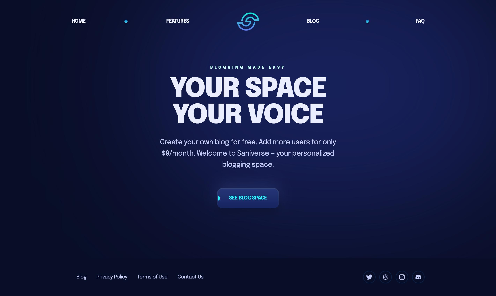
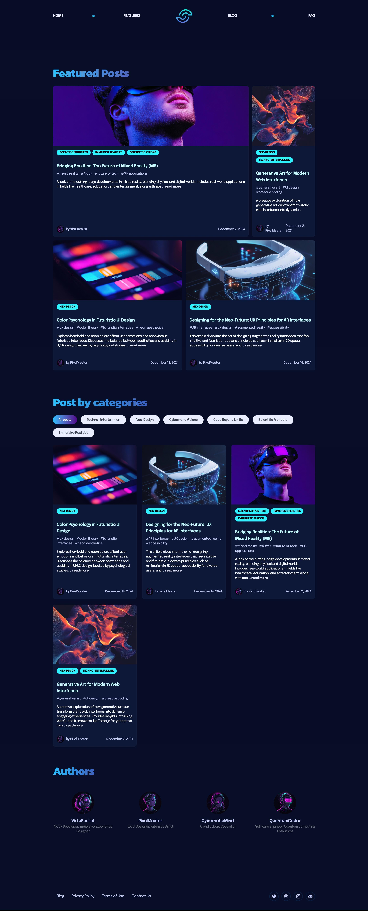
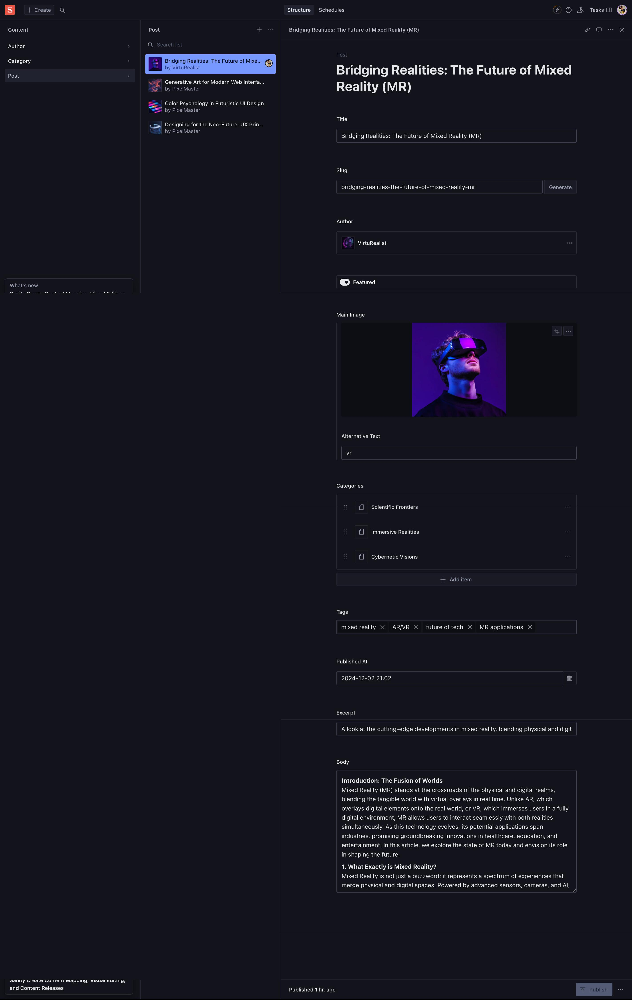

Below is the updated and extended `README.md` for your Astro project, incorporating your requirements:

---

# Astro 5 + Sanity Integration

## 📖 Overview

This project demonstrates the integration of **Astro 5** with **Sanity CMS**, providing a powerful, scalable solution for managing dynamic content. The application utilizes React components alongside Astro for a seamless development experience and dynamic content loading via loaders. The admin panel for managing content is accessible through the `/studio` route.

<p align="center">
  
</p>

## 🌍 Live

Check out the live demo of the project here: [Live Site](https://saniverse-cms.vercel.app/)

## 💻 Technology Stack


## 📝 Features

### Integration Highlights

- **Astro 5 + React**: Combines the static-site generation power of Astro with the interactivity of React.
- **Sanity CMS**: A flexible headless CMS for dynamic content management.
- **Dynamic Content Loaders**: Uses Astro loaders for fetching and rendering Sanity data dynamically.
- **Category and Tag Management**: Content is organized with categories and tags for intuitive navigation.
- **Pagination**: Efficiently handles large sets of data with server-side pagination.

<p align="center">
  
</p>

### Admin Panel (`/studio`)

- A dedicated route for managing all content via **Sanity Studio**.
- Features include: - Adding, editing, and deleting posts. - Managing categories and tags. - Real-time content updates with preview capabilities.
      <p align="center">
      
      </p>

---

### Landing Page

- Fully responsive and optimized for SEO.
- A clean, modern design showcasing featured blog posts and categories.

### React Integration

- React components are seamlessly integrated into the Astro project for dynamic and interactive features, such as:
    - Category selection dropdowns.
    - Tag filters with autocomplete.
    - Interactive blog cards.

---

## 🧞 Commands

| Command                   | Action                                      |
| :------------------------ | :------------------------------------------ |
| `npm install`             | Installs dependencies                       |
| `npm run dev`             | Starts local dev server at `localhost:4321` |
| `npm run build`           | Builds the production site to `./dist/`     |
| `npm run preview`         | Previews the production build locally       |
| `npm run astro ...`       | Run Astro CLI commands                      |
| `npm run astro -- --help` | Get help using the Astro CLI                |

---

## ⚙️ Configuration

To set up the project locally:

1. Clone the repository:
    ```bash
    git clone [repository_url]
    ```
2. Navigate to the project directory:
    ```bash
    cd [project_name]
    ```
3. Install dependencies:
    ```bash
    npm install
    ```
4. Run the development server:
    ```bash
    npm run dev
    ```

The app will be available at `http://localhost:4321`.

---

## 👀 Documentation

- **Astro**: [Astro Documentation](https://docs.astro.build)
- **Sanity CMS**: [Sanity Documentation](https://www.sanity.io/docs)

---

## 💬 Feedback

Feel free to open an issue or submit a pull request.

## ⚠️ License

[MIT](https://choosealicense.com/licenses/mit/)

---
